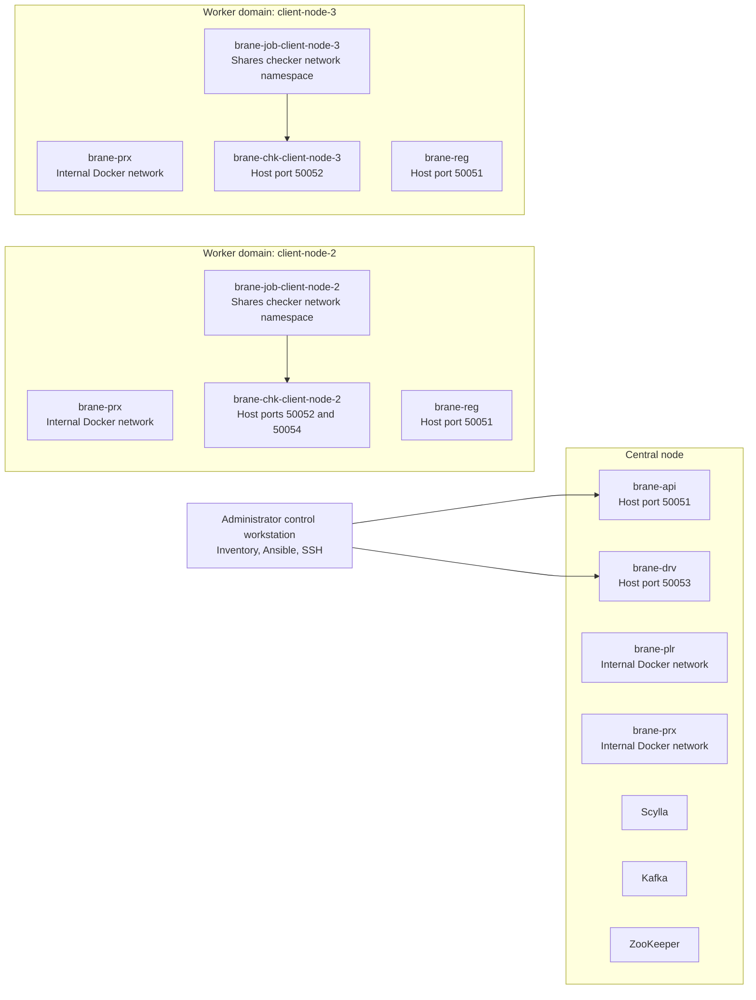

# 2. Deployed Brane Architecture Reference

> **Audience:** Administrators, infrastructure engineers, and contributors maintaining the Docker/Ansible deployment.
> **Baseline:** `brane-deployment` `main@369392b991e0c3290739077d0ad071b5ce3f76bb`; runtime verification on 2026-08-19.
> **Scope:** The active Docker/Ansible deployment, not a general Brane language or protocol specification.

## 2.1 Deployment model

The supported deployment is managed from `docker-deployment/` through Ansible and its inventory. The verified baseline consists of one central node and two worker domains.

- **Central node:** API, driver, planner, proxy, Scylla, Kafka, and ZooKeeper containers.
- **Worker domain:** proxy, registry, checker, and job containers, plus local configuration, certificates, policy material, data, results, and packages.
- **Control plane:** An administrator workstation uses Ansible and SSH with the deployment inventory.

The current deployment templates assume two named worker positions. Do not describe arbitrary worker-count scaling as supported without updating and validating those templates.

## 2.2 Topology



The diagram identifies deployed placement and verified host-port publication. Firewall rules, certificates, proxy configuration, and active policies still determine whether a connection or workflow is permitted.

## 2.3 Central-node services

All central Brane containers run on `brane-central_default`.

| Container | Verified host port | Mounted inputs | Responsibility |
|---|---:|---|---|
| `brane-api` | `50051/tcp` | `/node.yml`, certificates, `infra.yml`, packages | Central API service. |
| `brane-drv` | `50053/tcp` | `/node.yml`, certificates, `infra.yml` | Driver service for workflow execution. |
| `brane-plr` | None | `/node.yml`, `infra.yml` | Planner on the internal network. |
| `brane-prx` | None | `/node.yml`, certificates, `proxy.yml` | Central proxy on the internal network. |
| `brane-central-aux-scylla-1` | None published | Scylla data volume | Supporting database. |
| `brane-central-aux-kafka-1` | None published | None | Supporting message broker. |
| `brane-central-aux-zookeeper-1` | None published | None | Kafka coordination. |

Runtime verification confirms `brane-api` on `50051` and `brane-drv` on `50053`. A legacy configuration value using central port `30051` conflicts with this state and must not be documented as the active API endpoint.

## 2.4 Worker-domain services

Each verified worker runs its Brane containers on `brane-worker_default`.

| Container | Verified host port | Mounted inputs | Responsibility |
|---|---:|---|---|
| `brane-prx` | None | `/node.yml`, certificates, `proxy.yml` | Worker-domain proxy. |
| `brane-reg` | `50051/tcp` | `/node.yml`, backend configuration, certificates, secrets, policy database, data, results | Worker registry and local resource-access service. |
| `brane-chk-<location-id>` | `50052/tcp` | `/node.yml`, certificates, secrets, policy database | Policy checker. |
| `brane-job-<location-id>` | None directly | `/node.yml`, backend configuration, certificates, policy database, data, results, packages, Docker socket | Worker job execution. |

At the audit snapshot, `client-node-2` additionally published `50054/tcp` through the checker/job shared network namespace. `client-node-3` did not publish that port. Do not present `50054` as a cluster-wide endpoint until its configuration difference and intended function are verified.

## 2.5 Checker and job network arrangement

`brane-job-<location-id>` uses Docker network mode equivalent to `container:brane-chk-<location-id>`. It shares the checker network namespace rather than receiving an independent Docker address or independently published host ports.

1. The job container has no directly published host port.
2. The checker publishes ports for their shared network namespace.
3. Generated worker configuration reaches the checker from the job through `localhost`.
4. The job mounts `/var/run/docker.sock`; this is privileged operational access required by the current execution arrangement.

## 2.6 Policy and protected runtime material

The checker mounts the policy database and worker secrets directory. The registry also mounts the policy database and secrets. The job mounts the policy database but not the secrets directory in the verified runtime layout.

The deployment starts with deny-all policy behaviour. A workflow can reach worker infrastructure and still be denied until an applicable policy has been uploaded and activated.

Documentation may name configuration directories and public endpoints, but must not include token values, private keys, certificate bundles, or secret-file contents.

## 2.7 Generated configuration and persistent paths

### Central node

Verified installation root: `/home/adam/brane-central/`.

| Path | Purpose |
|---|---|
| `node.yml` | Generated central node configuration mounted into Brane services. |
| `config/certs/` | Central certificate material. |
| `config/infra.yml` | Federated infrastructure configuration. |
| `config/proxy.yml` | Central proxy configuration. |
| `packages/` | Packages mounted into `brane-api`. |

### Worker node

Verified installation root: `/home/adam/brane-worker/`.

| Path | Purpose |
|---|---|
| `node.yml` | Generated worker node configuration. |
| `config/backend.yml` | Worker backend configuration. |
| `config/certs/` | Worker certificate material. |
| `config/proxy.yml` | Worker proxy configuration. |
| `config/secrets/` | Worker secret files; never publish contents. |
| `policies.db` | Local policy-store database. |
| `data/` | Worker-local datasets. |
| `results/` | Workflow results. |
| `packages/` | Packages available to worker jobs. |

These paths identify the verified deployment user and layout. Other deployments must derive equivalent paths from inventory variables rather than copying them literally.

## 2.8 Administrator health check

The health check is read-only. It verifies expected installation paths and containers through Ansible inventory lookup plus SSH.

```sh
cd /path/to/brane-deployment/docker-deployment
PATH="../venv/bin:$PATH" bash ../scripts/brane_healthcheck.sh --report
```

At the baseline audit, this command completed with 37 checks passed and 0 checks failed. The default inventory path is relative to the current working directory; invoking the script from the repository root without an explicit inventory path fails.

## 2.9 Superseded identifiers and procedures

Do not use these as current operational identifiers:

- `brane-driver`; use `brane-drv`.
- `brane-planner`; use `brane-plr`.
- `brane-registry`; use `brane-reg` on workers.
- `brane-proxy`; use `brane-prx`.
- Manual topology setup based on standalone `branectl download`, `branectl generate`, and `branectl start` commands.

Direct `branectl` procedures are assessed separately in the command audit.

## 2.10 Verification record

| Check | Result | Date |
|---|---|---|
| Central and worker installation layouts | Passed | 2026-08-19 |
| Expected central and worker containers | Passed | 2026-08-19 |
| Central API host port `50051` | Verified at runtime | 2026-08-19 |
| Central driver host port `50053` | Verified at runtime | 2026-08-19 |
| Worker registry host port `50051` | Verified at runtime | 2026-08-19 |
| Worker checker host port `50052` | Verified at runtime | 2026-08-19 |
| Job/checker shared network namespace | Verified at runtime | 2026-08-19 |
| Worker `client-node-2` extra port `50054` | Observed; semantics pending verification | 2026-08-19 |

---
*Last verified against [brane-deployment](https://github.com/AdamBelloum/brane-deployment) @ `369392b9` on 2026-08-20.*
